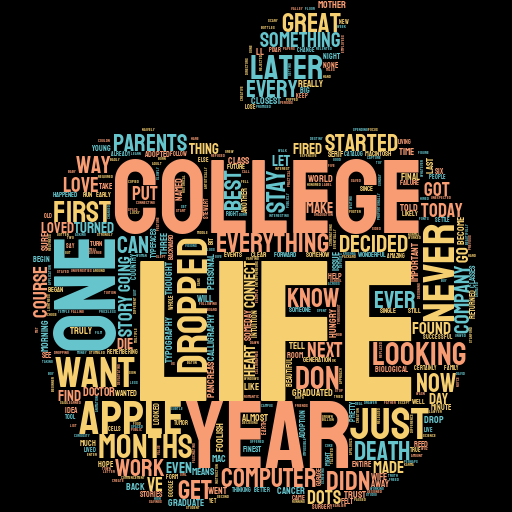

# Stylish WordCloud
To make different and beautiful wordcloud in python using stylecloud and wordcloud libraries of python.

### Python libraries for this:
1. stylecloud
2. wordcloud
3. pillow 
4. stop-words
5. numpy
6. matplotlib

### Commands to install stylecloud , wordcloud and pillow
`pip install stylecloud wordcloud Pillow stop-words`

The dataset is the <b>speech of Steve Jobs at Stanford University</b> in `.txt` format

